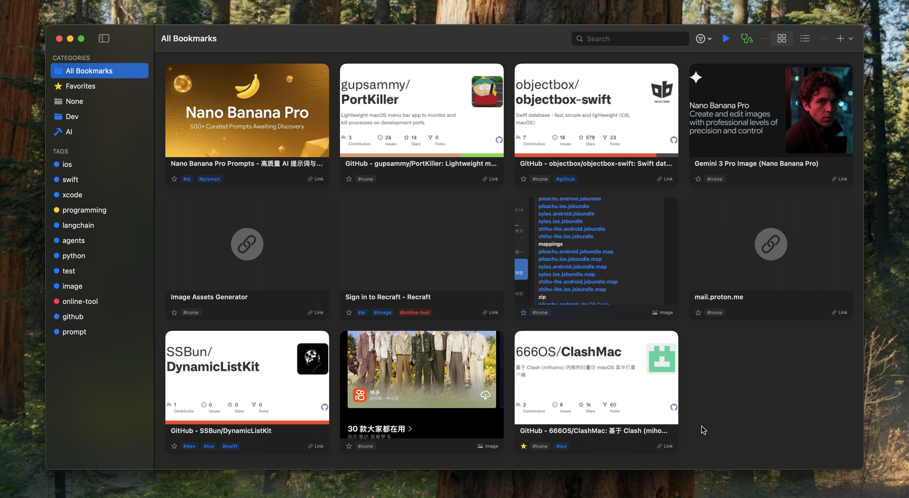

**English** | [中文](README.md)

# Seahorse

An elegant macOS material collection and management tool that makes saving inspiration simple and natural.

## Why Choose Seahorse?

Seahorse is more than just a bookmark manager—it's a versatile material collection tool. Whether it's web links, images, or text snippets, Seahorse helps you save and organize everything effortlessly.

## Core Features

### 🚀 Lightning-Fast Saving

**Double Copy Auto-Save**
- Quickly copy the same content twice in succession, and Seahorse will automatically detect and save it
- No need to open the app or perform manual operations—your inspiration is saved instantly

**Paste to Save in Window**
- Simply paste (⌘V) directly in the Seahorse window, and content is automatically recognized and saved
- Supports intelligent recognition of multiple formats including URLs, text, and images

### 📦 Multi-Type Material Support

**More Than Just Bookmarks**
- **Web Links**: Automatically fetches title, icon, and preview image
- **Images**: Supports both local and network images
- **Text Snippets**: Save code snippets, notes, ideas, and any text content

### 🗂️ Smart Organization

**Category Management**
- Create custom categories with colors and icons for easy distinction
- Quickly switch between different categories to view content

**Tag System**
- Add multiple tags to materials for flexible organization
- Quickly filter and find content by tags

**Favorites**
- Mark important content as favorites for quick access

### 🔍 Powerful Search

- Real-time search across all saved content
- Search by title, URL, or text content
- Quickly locate the materials you need

### 📊 Multiple View Modes

**Grid View**
- Card-based display that's intuitive and beautiful
- Supports image and icon previews

**List View**
- Compact display with high information density
- Perfect for quickly browsing large amounts of content

### ⚙️ Personalized Settings

- Custom storage location
- Adjust copy detection time window
- Enable/disable auto-save functionality
- Multi-language support

### 📤 Import & Export

- Import bookmarks from browsers
- Export to JSON format
- Batch import support

## Use Cases

- **Designers**: Collect design inspiration, reference images, color schemes
- **Developers**: Save technical documentation, code snippets, tool links
- **Researchers**: Organize paper links, research notes, data materials
- **Content Creators**: Collect materials, inspiration, reference resources
- **Everyone**: Save anything you want to remember

## System Requirements

- macOS 13.0 or later

## Download

Download the latest DMG installer from the [Releases](https://github.com/SSBun/Seahorse/releases) page.

## Getting Started

1. Download and install Seahorse
2. Open the app and grant necessary permissions
3. Start collecting your materials!

**Quick Start:**
- Copy a link, then quickly copy it again → Auto-saved
- Paste any content in the Seahorse window → Auto-saved
- Click the ➕ button in the toolbar to manually add content

## Feedback & Support

If you have questions or suggestions, please feel free to open an issue on [GitHub Issues](https://github.com/SSBun/Seahorse/issues).

---

Making collection simple, ensuring inspiration is never lost. Seahorse, your material collection assistant.

